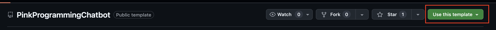
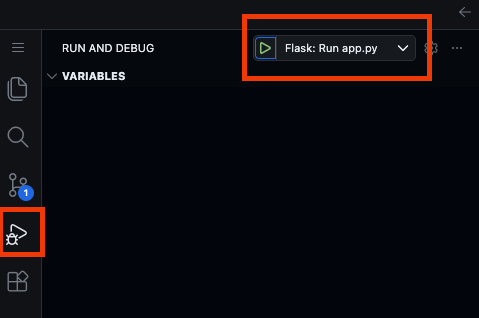
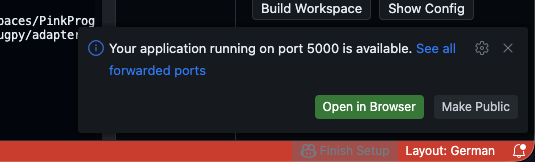
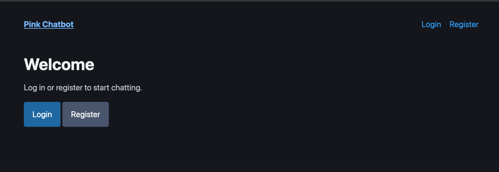
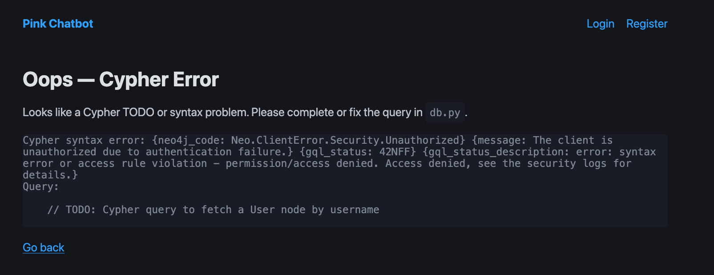
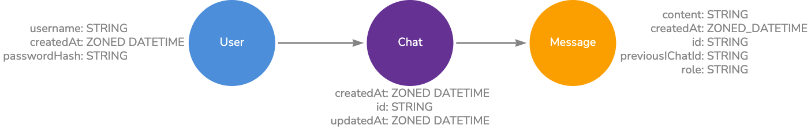

# Pink Programming Chatbot (Using Flask + Neo4j)

Welcome to the Pink Programming Chatbot workshop! Today we will build a chatbot that stores users, chats, and messages in Neo4j.
Your goal is to complete the Cypher TODOs in `db.py` to get a working chatbot.
Good Luck!

## Overview
- This code base is a Flask web app scaffold for a chatbot that stores users, chats, and messages in Neo4j.
- Your goal is to complete the Cypher TODOs in `db.py` to enable user auth, chat creation, and viewing history.
- Use OpenAI through the Cypher GenAI Plugin integration.

## Quick Start with Codespaces
- Create an account on https://console.neo4j.io/ and create a free Aura instance (make sure to save the password).
- **Important**: Connect to the database (click query) and run the command: `ALTER DATABASE <db_name> SET DEFAULT LANGUAGE CYPHER 25` in order to get the correct Cypher version.

- In the GitHub repository click the green "Use this template" button and open the project in a codespace.

- Copy `.env.example` to `.env` and set values.
  - `NEO4J_USERNAME`: This should be the same name as your Aura instance.
  - `NEO4J_CONNECTION_URI`: Inspect your Aura instance and copy the connection URI.
  - `NEO4J_PASSWORD`: paste password that you got during the instance creation.

- Open the Run and Debug menu and start the "Flask: run app.py" configuration.

- It opens a terminal and starts the Flask development server, click on the link to open the app in a new browser tab.

- Try registering a new user, you should see Cypher Error page which means you're ready to start the exercises!

## Workshop Tasks (Cypher TODOs in `db.py`)
- Create/Login User
  - `create_user(username, password_hash)`: create a `:User` with properties and return it.
  - `fetch_user_by_username(username)`: find a `:User` by username and return it.
- Chat With Chatbot
  - `create_chat_and_first_message(username, message)`: create a `:Chat` and the first user `:Message`.
  - `create_message(chat_id, role, content, previous_ai_chat_id)`: append messages (both user and ai) to a chat.
- See Previous Chats
  - `list_user_chats(username)`: get all chats for the user, return a summary in a list.
  - `fetch_chat(chat_id)`: return full chat with messages ordered by time.
  - `get_ai_response(chat_id, previous_chat_id, message)`: get the response from the OpenAI API.
  - `get_previous_ai_chat_id(chat_id)`: find the previous AI chat id for a given chat id to send to OpenAI.

Pages
- `/register` and `/login`: basic authentication using Flask sessions.
- `/chat/new`: start a new chat by sending the first message.
- `/chats`: list previous chats.
- `/chats/<chat_id>`: view and continue a chat.

## Clean Database
You may want to reset your database to start fresh, do this in the Aura console and run "MATCH (n) DETACH DELETE n"

## Database Model

## Possible Extensions
- Add a delete chat option
- Add a delete User option